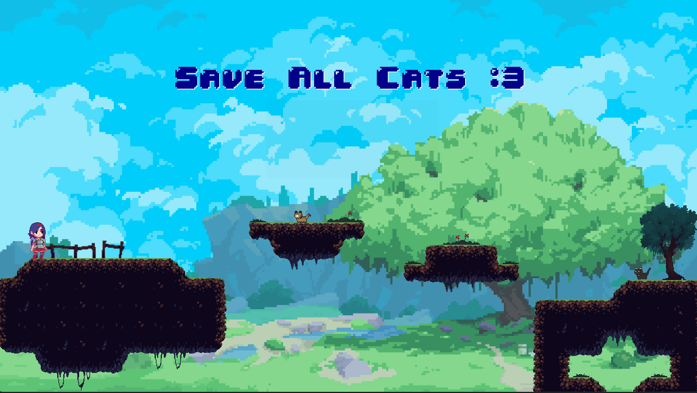
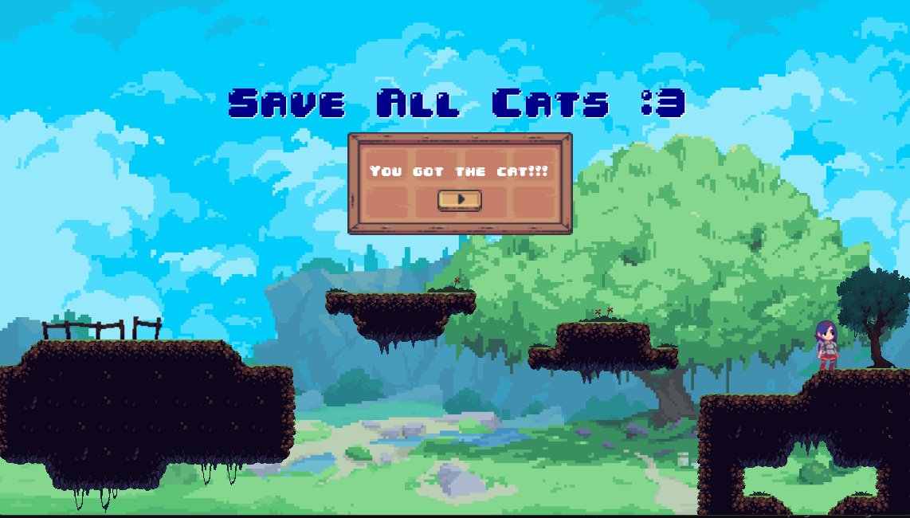

# 🏰 **Girl Knight Rescues the Cat** 🏰

Selamat datang di **Girl Knight Rescues the Cat**! 🎮
Game platformer ini mengisahkan seorang ksatria wanita pemberani yang harus menyelamatkan seekor kucing dari bahaya. Gunakan berbagai mekanika pergerakan canggih untuk mencapai tujuan dan selesaikan tantangan di sepanjang perjalanan!

---

## 🚀 **Fitur Pergerakan Karakter**

### ✨ **1️⃣ Double Jump**
Karakter dapat melompat dua kali sebelum menyentuh tanah kembali. Jika pemain menekan tombol lompat saat di udara, karakter akan melakukan lompatan tambahan.

### ⚡ **2️⃣ Dashing (→ / ← + Shift)**
Karakter dapat meluncur cepat ke depan dengan menekan **Arrow Kanan/Kiri + Shift**. Dashing memungkinkan pemain menghindari serangan atau mencapai platform yang lebih jauh dalam waktu singkat.

### 🛡️ **3️⃣ Crouching**
Dengan menekan tombol **panah bawah**, karakter dapat berjongkok. Saat jongkok, karakter bergerak lebih lambat.

### 🎭 **4️⃣ Animasi Tambahan**
- **Idle**: Animasi diam saat karakter tidak bergerak.
- **Fall**: Animasi jatuh ketika karakter turun dari platform atau setelah melompat.
- **Landing**: Animasi saat karakter menyentuh tanah setelah melompat atau jatuh.

---

## 🎮 **Cara Bermain**

| **Aksi**         | **Tombol**              |
|------------------|------------------------|
| Bergerak        | ⬅️ ➡️ (panah kiri/kanan)  |
| Melompat        | ⬆️ (panah atas)          |
| Double Jump     | ⬆️ (dua kali)            |
| Dashing         | Shift + ⬅️ / ➡️           |
| Crouching       | ⬇️ (panah bawah)          |

---

## 🎨 **Implementasi Pergerakan**
- **Double Jump**: Menambahkan kondisi tambahan agar karakter bisa melompat dua kali sebelum menyentuh tanah.
- **Dashing**: Menggunakan input **Arrow + Shift** untuk memberikan efek dorongan ke arah tertentu dalam waktu singkat.
- **Crouching**: Menggunakan Sprite khusus Crouching dan memperlambat kecepatan saat tombol jongkok ditekan.
- **Idle, Fall, Landing**: Menggunakan **Sprite2D** dengan **AnimationPlayer** untuk mengganti animasi berdasarkan kondisi karakter.

---

## 🌄 **Menambahkan Background Image**
Background diletakkan menggunakan **TextureRect** dan diatur agar selalu berada di belakang elemen lain dalam game.

---

## 🎯 **Tujuan Game**

- Selamatkan kucing dengan mengatasi berbagai rintangan!
- Gunakan mekanika pergerakan dengan cermat untuk menyelesaikan tantangan.
- Capai kucing di titik akhir level untuk menang!

---
## 🏆 **Aset**
- [Cat Sprite](https://toffeecraft.itch.io/cat-pixel-mega-pack)
- [Girl Knight Sprite](https://jumpbutton.itch.io/girlknightasset)
- [Background Image](https://theflavare.itch.io/mondstadt-theme-background-pixel-art)
- [Platform](https://theflavare.itch.io/mondstadt-theme-background-pixel-art)
- [Walk SFX](https://kenney.nl/assets/rpg-audio)
- [Rescue Cat Feedback SFX](https://mixkit.co/free-sound-effects/cat/)
- [Background Music](https://rotemus.itch.io/fantasy-interactive-music-pack)

## 🏆 **Referensi**
- [Godot 4 Documentation](https://docs.godotengine.org/en/stable/)
- [Godot Official Tutorials](https://www.youtube.com/c/GodotEngineOfficial)
